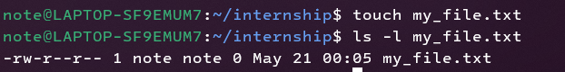
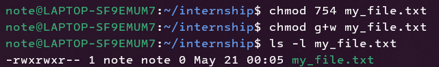
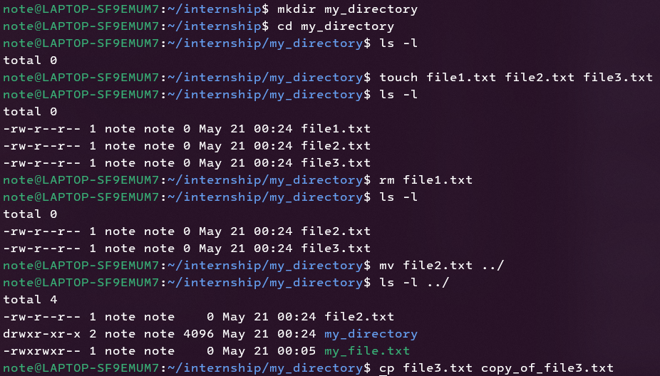
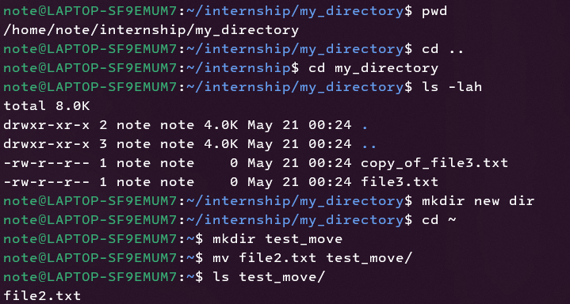
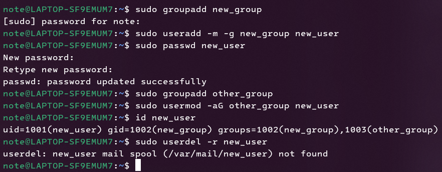
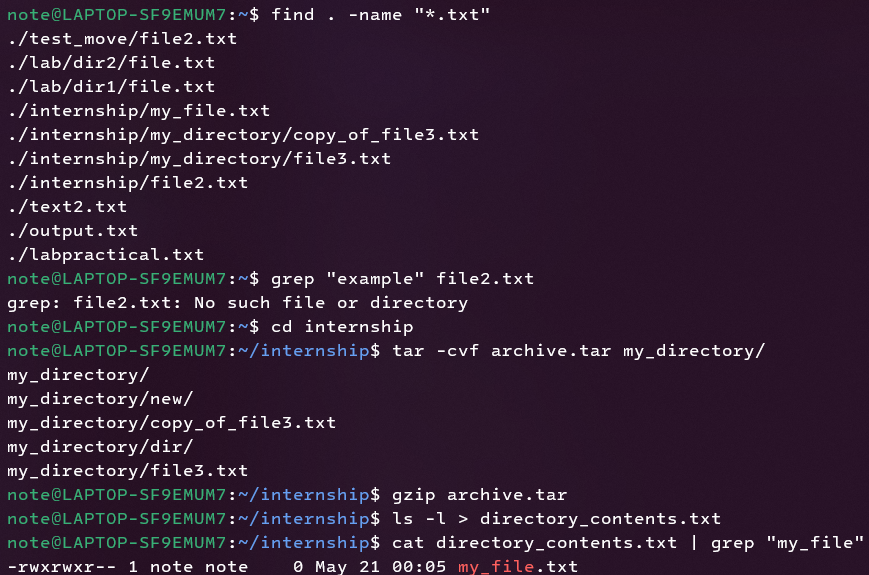
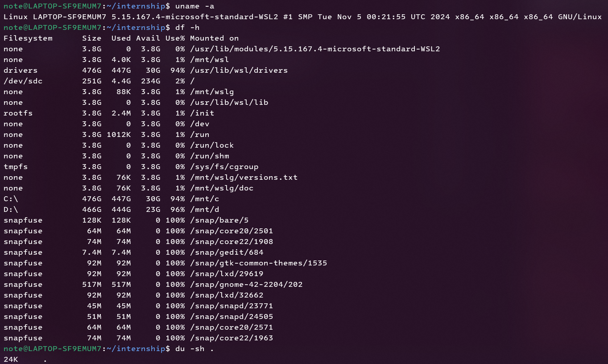

# Assignment Linux 


## 1. Create a file, assign permissions (read, write, execute) to different user categories (owner, group, others), and practice changing permissions using chmod.

### Solution

1. **Create a new file:**

   ```bash
   touch my_file.txt
   ```

2. **Check file permissions:**

   ```bash
   ls -l my_file.txt
   ```

   Output:

    

   * `-`: regular file
   * `rw-`: owner has read and write
   * `r--`: group has read
   * `r--`: others have read

3. **Change permissions:**

   * Give **owner (7)** = read (4) + write (2) + execute (1)
     **group (5)** = read (4) + execute (1)
     **others (4)** = read (4)

        ```bash
        chmod 754 my_file.txt
        ```

   * Give the group write permission:

     ```bash
     chmod g+w my_file.txt
     ```

4. **Verify changes:**

   ```bash
   ls -l my_file.txt
   ```
    Output:  
     
---

## 2. Execute basic Linux commands (e.g., ls, cd, mkdir, rm, touch) to manipulate files and directories, with an emphasis on understanding their usage.

### Solution

1. **Create a new directory:**

   ```bash
   mkdir my_directory
   ```

2. **Change into the directory:**

   ```bash
   cd my_directory
   ```

3. **List directory contents:**

   ```bash
   ls -l
   ```

4. **Create files:**

   ```bash
   touch file1.txt file2.txt file3.txt
   ls -l
   ```

5. **Remove a file:**

   ```bash
   rm file1.txt
   ls -l
   ```

6. **Move a file to a different directory:**

   ```bash
   mv file2.txt ../
   ls -l ../
   ```

7. **Additional commands:**

   ```bash
   cp file3.txt copy_of_file3.txt   
   ```
    Output:
     
---

## 3. Using the terminal, practice navigating through directories, listing file contents, and moving files to different locations.

### Solution

1. **Show current directory:**

   ```bash
   pwd
   ```

2. **Navigate back a directory:**

   ```bash
   cd ..
   ```

3. **Navigate forward:**

   ```bash
   cd my_directory
   ```

4. **List with options:**

   ```bash
   ls -lah
   ```
   * `-l`: long format
   * `-a`: list all files
   * `-h`: human-readable file sizes

5. **Go to home directory:**

   ```bash
   cd ~
   ```

6. **Move files between directories:**

   ```bash
   mkdir test_move
   mv file2.txt test_move/
   ls test_move/
   ```
 
    Output:  
     
---

## 4. Create a new user and group, set their permissions, and explore user management commands like useradd, usermod, and userdel.

### Solution

1. **Create a new group:**

   ```bash
   sudo groupadd new_group
   ```

2. **Create a new user in the group:**

   ```bash
   sudo useradd -m -g new_group new_user
   ```

3. **Set user password:**

   ```bash
   sudo passwd new_user
   ```

4. **Modify user's groups:**

   ```bash
   sudo groupadd other_group    
   sudo usermod -aG other_group new_user
   id new_user
   ```

5. **Delete the user:**

   ```bash
   sudo userdel -r new_user
   ```

6. **Command purposes:**

   * `groupadd`: create group
   * `useradd`: create user
   * `passwd`: set password
   * `usermod -aG`: add to supplementary group
   * `userdel -r`: delete user and home directory  
    Output:  
     
---

## 5. Practices more linux commands

### Solution

1. **Search files:**

   ```bash
   find . -name "*.txt"
   grep "example" my_file.txt
   ```

2. **Compression & archiving:**

   ```bash
   tar -cvf archive.tar my_directory/
   gzip archive.tar
   ```

3. **Redirection & piping:**

   ```bash
   ls -l > directory_contents.txt
   cat directory_contents.txt | grep "my_file"
   ```

4. **System info:**

   ```bash
   uname -a   # Kernel/system info
   df -h      # Disk space
   du -sh .   # Directory size
   ```
    Output:  
     
     
